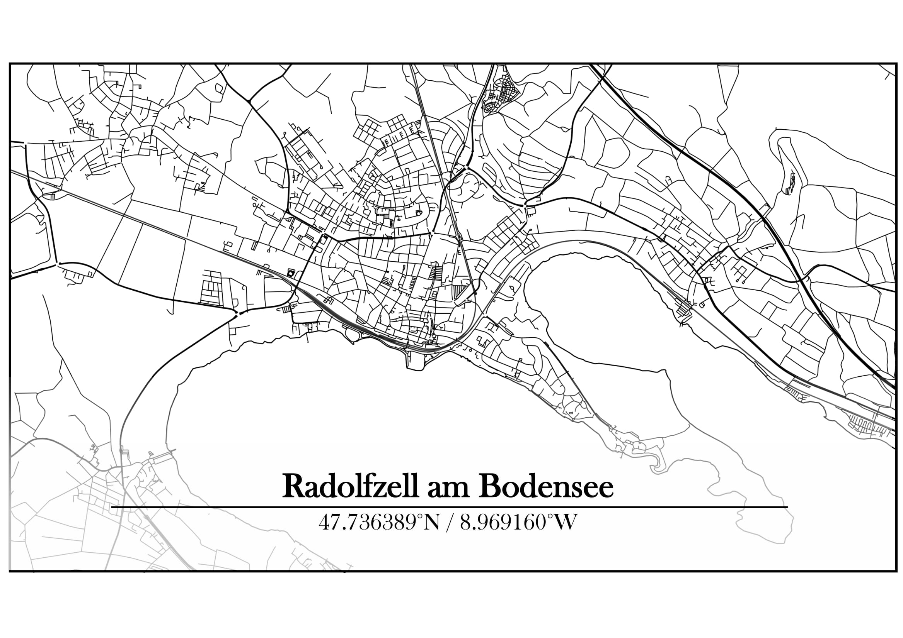
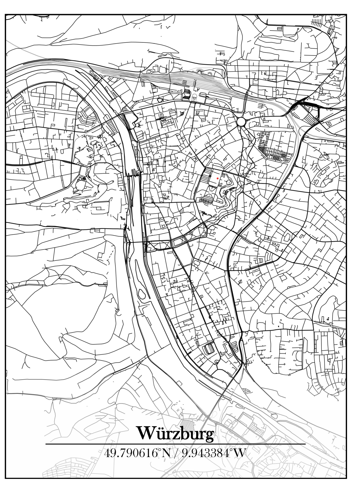

# Streetmaps with OSM data
This repo demonstrates how to create streetmaps based on [OpenStreetMap (OSM)](https://www.openstreetmap.de/) data with R.
This repo includes a R script (`osm_streetmaps.R`) which explains how to access and download OSM features (e.g., streets, rivers, rails, etc.) by the usage of the `osmdata` library.
The script also shows how to display the downloaded OSM data in an appealing way on a `ggplot2` map.

---
For the map creation the following steps are needed:
* Definition of AOI extent
* Selection of OSM features to display
* Download of OSM features
* Plot features on map
---

The script is based on this great tutorial by [ggplot2tor](https://ggplot2tutor.com/tutorials/streetmaps).

If you want to recreate a map with other locations you may need to alter the downloaded OSM features. In general, the smaller the extent of your AOI the more detailed features can be displayed in the map.
If you choose a big AOI extent and still plot all detailed features (e.g., really small streets like pathways) the map won´t look nice since its to densly populated by features.

To create a label with the city/area name use the provided code in (`osm_streetmaps.R`). However, exporting a blank map as PDF and importing it to Word is another option.
Within Word the label creation can be done by inserting a text field.

## Examples

#### City label and coordinates created in R

#### City label and coordinates created in Word

<table>
  <tr>
    <td></td>
    <td></td>
  </tr>
</table>
